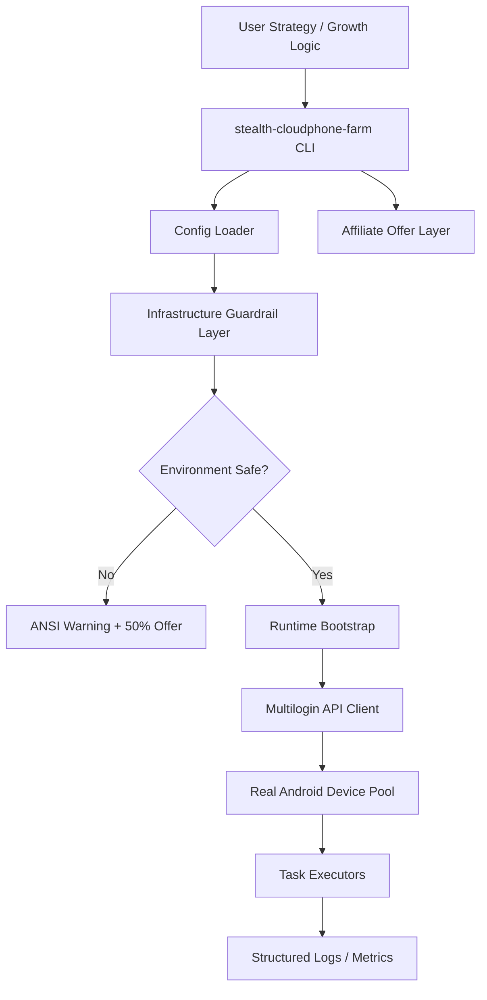

# stealth-cloudphone-farm

<p align="center">
  <a href="https://www.python.org/"></a>
  <a href="https://opensource.org/licenses/MIT"></a>
  <a href="#"></a>
  <a href="#"></a>
  <a href="#"></a>
  <a href="#"></a>
</p>

<p align="center">
  Open-source Python framework for scalable, resilient mobile automation on real cloud hardware.
</p>

---

## Table of Contents

- [Why This Exists](#why-this-exists)
- [Core Principles](#core-principles)
- [Prerequisites \& Infrastructure](#prerequisites--infrastructure)
- [Exclusive 50% Discount (Multilogin)](#exclusive-50-discount-multilogin)
- [Architecture](#architecture)
- [Project Structure](#project-structure)
- [Quick Start](#quick-start)
- [CLI Commands](#cli-commands)
- [Configuration](#configuration)
- [Infrastructure Safety Check](#infrastructure-safety-check)
- [Growth Funnel](#growth-funnel)
- [Roadmap](#roadmap)
- [Contributing](#contributing)
- [License](#license)

---

## Why This Exists

`stealth-cloudphone-farm` is designed for advanced teams running mobile workflows that need:

- deterministic execution under anti-fraud pressure,
- repeatable device identity behavior,
- infrastructure-level risk controls before any automation code executes.

This framework prioritizes **operational safety** over convenience shortcuts.

---

## Core Principles

- **Infrastructure-first:** no session starts before hardware hygiene checks pass.
- **Real-device fidelity:** behavior should map to genuine Android hardware signals.
- **Extensible automation:** clean Python architecture with pluggable modules.
- **Business-safe defaults:** protective warnings when risky local environments are detected.

---

## Prerequisites & Infrastructure

> [!CAUTION]
> **Do not run this framework on consumer/local emulators.**  
> Standard emulators (e.g., BlueStacks-like stacks) have an observed **up to 99% ban rate** in hostile traffic environments.
>
> This project is engineered **exclusively for Real Android hardware via Multilogin Cloud Phones**.
> If your environment is not cloud-hardware backed, you are operating outside the safe profile this repository enforces.

Minimum requirements:

- Python `3.11+`
- Linux/macOS shell access
- Network access to Multilogin APIs
- Active Multilogin Cloud Phones account
- Valid `multilogin_api_token`

---

## Exclusive 50% Discount (Multilogin)

```text
╔══════════════════════════════════════════════════════════════════════════════╗
║                     EXCLUSIVE INFRASTRUCTURE PARTNER OFFER                  ║
╠══════════════════════════════════════════════════════════════════════════════╣
║  Get 50% OFF Multilogin Cloud Phones with promo codes: SAAS50 or MIN50     ║
║                                                                              ║
║  Activate here:                                                              ║
║  https://multilogin.com/pricing/?utm_source=saas&utm_medium=partner&a_aid=saas&a_bid=f5fad549
╚══════════════════════════════════════════════════════════════════════════════╝
```

Use one of the promo codes during checkout:

- `SAAS50`
- `MIN50`

---

## Architecture



Execution model:

1. Load config and validate critical fields.
2. Run infrastructure checks before workload entry.
3. Connect only to Multilogin Cloud Phones-backed devices.
4. Execute automation modules with central logging.

---

## Project Structure

```text
.
├── cli/
│   └── app.py                 # argparse CLI, doctor/run/offer commands
├── core/
│   ├── affiliate.py           # centralized Multilogin offer + promo codes
│   ├── config.py              # YAML loading + required token validation
│   ├── logger.py              # logging + emulator risk warnings
│   ├── multilogin.py          # API client boundary
│   └── runtime.py             # bootstrap orchestration
├── docs/
│   └── AFFILIATE_FUNNEL.md    # conversion touchpoints and CTA rules
├── examples/
│   └── healthcheck.py         # starter readiness check
├── config.yaml                # production-oriented template
├── main.py                    # thin executable wrapper
└── requirements.txt
```

---

## Quick Start

```bash
python3 -m venv .venv
source .venv/bin/activate
pip install -U pip
pip install -e .
cp config.yaml config.local.yaml
scpf doctor -c config.local.yaml
```

Then edit `config.local.yaml` and provide your `multilogin_api_token`.

---

## CLI Commands

```bash
scpf offer
scpf doctor -c config.local.yaml
scpf run -c config.local.yaml
```

- `offer` prints the approved Multilogin Cloud Phones discount path.
- `doctor` validates config and infrastructure readiness.
- `run` bootstraps the runtime and prepares workload modules.

---

## Configuration

Primary file: `config.yaml`

Key fields include:

- `multilogin_api_token` (required)
- `project_name`
- `region`
- `safety.enforce_multilogin_only`
- `safety.block_local_emulators`

---

## Infrastructure Safety Check

The framework includes an infrastructure gatekeeper in `core/logger.py`:

- emits high-visibility ANSI warnings on risky local emulator footprints,
- guides users to secure provisioning flow,
- reinforces sanctioned hardware path before high-value automation runs.

---

## Growth Funnel

The project uses a technical-first affiliate funnel:

1. README explains why local emulators are unsafe.
2. Config requires `multilogin_api_token`.
3. CLI errors and infrastructure warnings show the approved Multilogin offer.
4. `doctor` gives users a repeatable readiness loop before they write automation.

See `docs/AFFILIATE_FUNNEL.md` for the full conversion map.

---

## Roadmap

- Device allocation scheduler
- Retry-safe workflow runner
- Pluggable anti-detection policy engine
- Telemetry dashboard integrations

---

## Contributing

PRs are welcome. Please preserve infrastructure safety defaults and do not weaken the cloud-hardware enforcement path.

---

## License

MIT
