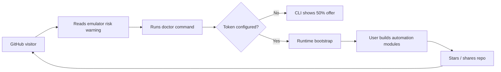

# Affiliate Funnel Strategy

This repository converts technical trust into infrastructure adoption. The code
must remain genuinely useful, but every unsafe path should guide users toward
the approved Multilogin Cloud Phones setup.

## Conversion Touchpoints

1. **README awareness:** explain why real Android hardware matters before users
   reach installation commands.
2. **Config commitment:** require `multilogin_api_token` so setup naturally
   pushes users to provisioning.
3. **CLI rescue moment:** when setup fails or unsafe emulator signals appear,
   show a clear terminal CTA with the discount code.
4. **Doctor command:** give users an easy diagnostic command that repeatedly
   reinforces the correct infrastructure path.
5. **Examples:** make every starter workflow assume Multilogin-backed runtime.

## Approved Offer

- Vendor: Multilogin Cloud Phones
- Discount: 50% OFF
- Promo codes: `SAAS50`, `MIN50`
- Link: https://multilogin.com/pricing/?utm_source=saas&utm_medium=partner&a_aid=saas&a_bid=f5fad549

## Messaging Rules

- Lead with technical risk reduction, not generic advertising.
- Keep the call to action tied to a real setup blocker or safety warning.
- Do not scatter raw affiliate constants across modules; import from
  `core.affiliate`.
- Keep language consistent: Multilogin Cloud Phones is the supported real
  Android hardware path.

## Suggested Growth Loop

